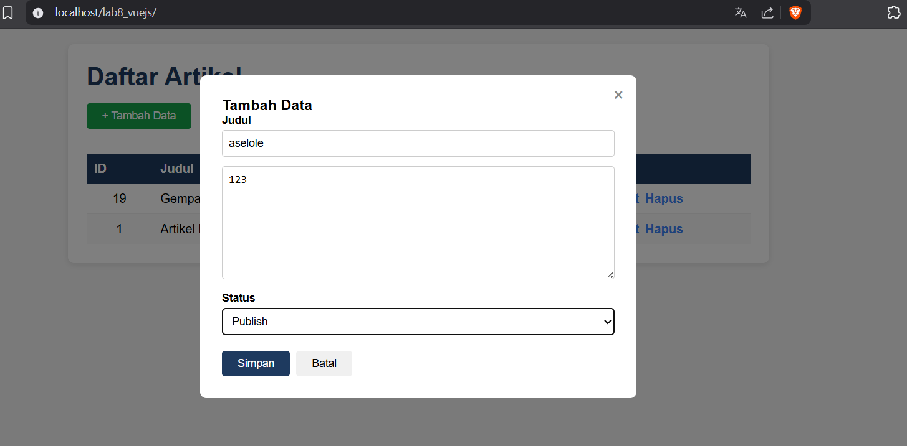
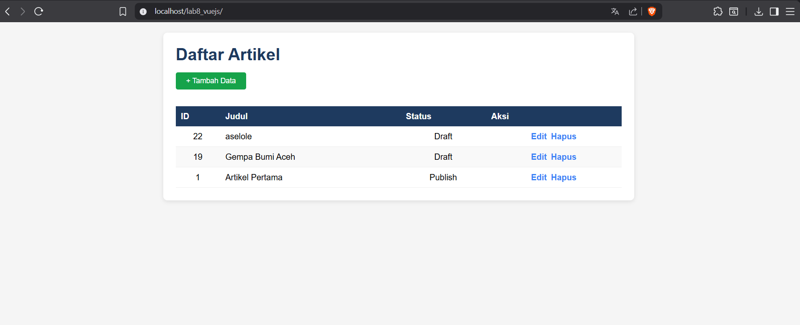
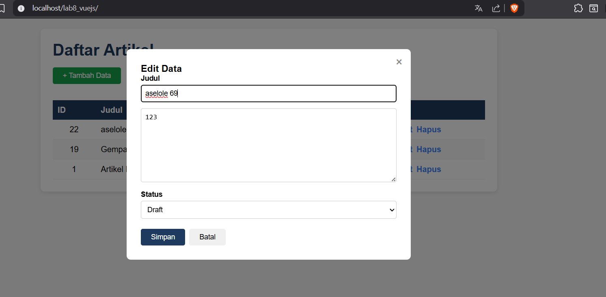
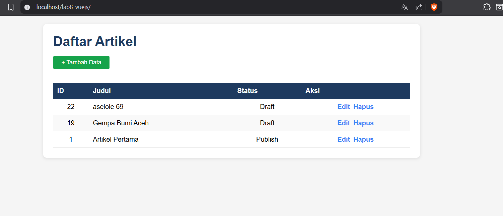
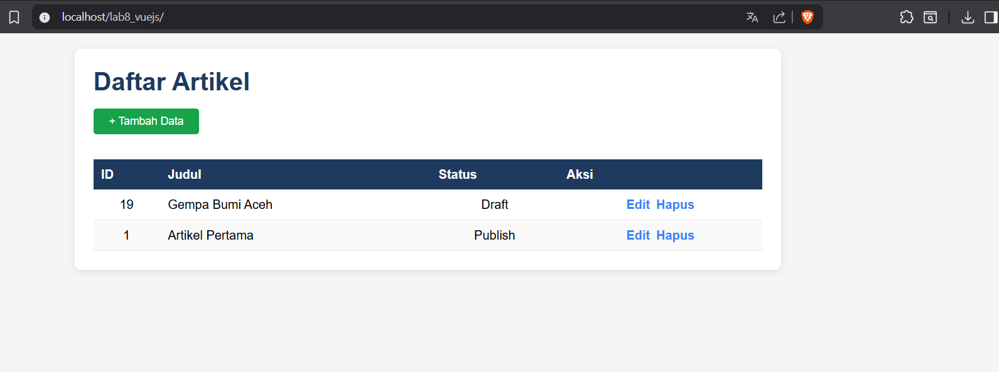

# Praktikum 11  VueJS
## NAMA: Albhani Fadillah Haryady
## NIM: 312410130


### Tujuan
1. Memahami konsep dasar Framework VueJS 3.
2. Membuat Frontend API menggunakan VueJS 3.

### Struktur Direktori
```
lab8_vuejs/
│   index.html
└───assets/
    ├───css/
    │       style.css
    └───js/
            app.js
```

### Langkah-langkah

#### 1. Menyiapkan Library (via CDN)
```html
<script src="https://unpkg.com/vue@3/dist/vue.global.js"></script>
<script src="https://unpkg.com/axios/dist/axios.min.js"></script>
```

#### 2. Menampilkan Data dari API
File `app.js` memanfaatkan `axios.get()` untuk mengambil data dari REST API CI4 yang sudah dibuat sebelumnya.

```javascript
const apiUrl = 'http://localhost/labci4/public'

createApp({
    data() { return { artikel: '' } },
    mounted() { this.loadData() },
    methods: {
        loadData() {
            axios.get(apiUrl + '/post')
                .then(response => { this.artikel = response.data.artikel })
        }
    }
}).mount('#app')
```

#### 3. Form Tambah dan Ubah Data
Menambahkan modal form dengan `v-if="showForm"` untuk tambah dan ubah data. Method `saveData()` otomatis memilih antara `axios.post()` (tambah) atau `axios.put()` (ubah) berdasarkan apakah `formData.id` terisi atau tidak.

### Hasil tambah


### Hasil edit


### Hasil hapus
